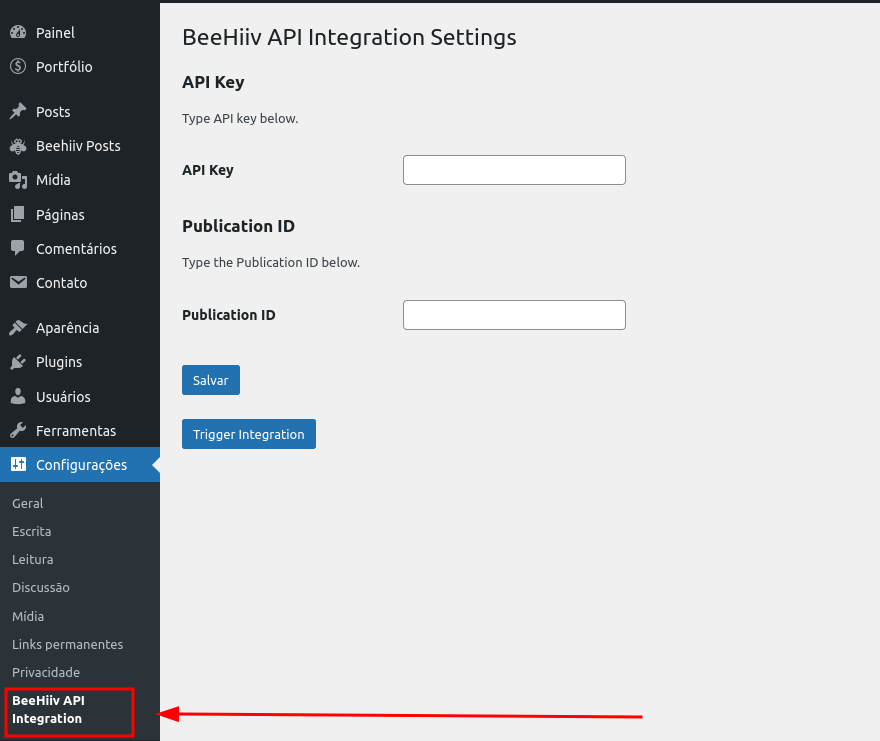
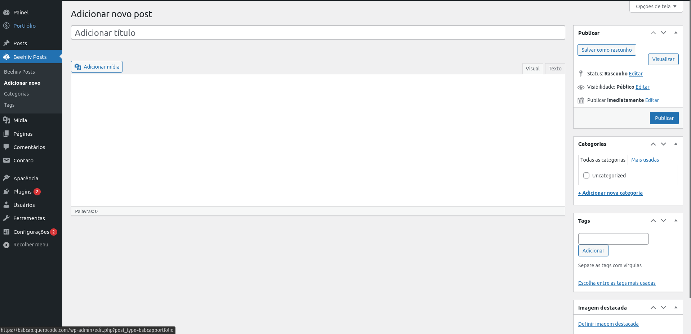

# Beehiiv API Integration to WordPress

Quick & Dirty working implementation of a WordPress plugin that integrates Beehiiv Posts to WP Custom Post Type named **Beehiiv Post** through [BeeHiiv API V2](https://developers.beehiiv.com/docs/v2/).

 Every two minutes, this plugins makes a call to BeeHiiv's API and fetches and stores any new posts that haven't been integrated. Any posts that have been scheduled but not published are not fetched.

## This plugin features

 1. A settings page where you can set which API Key and Publication ID will be used in every API call.
 

 1. A custom post type called Beehiiv Post.
 

 1. A cron schedule that runs the integration function every two minutes.

## This plugin does not feature

1. Fetching from more than one Publication or API key.
1. Custom scheduling - Cron interval is currently hardcoded 
1. Keeping track of runs. There is no way to see if last runs have succeded or failed, nor there is a way to see when future runs will happen.
1. Custom fields in its custom post type - Not every information available in the API about a Beehiiv Post is stored, and whatever is, is stored in one of WordPress Post's default fields (title, excerpt, content, etc).

## Future Improvements

If I think this plugin is worthwhile, I might keep working on it. In that case, I will likely begin by improving its customizability. This could include adding support for custom cron intervals, integrating with multiple API publications, and creating additional fields in the custom post type. 

Then I would possibly create a new post type called "Beehiiv Integration Runs" to store data about each integration, including whether it succeeded or failed, the number of posts integrated, the number that failed to integrate, and which posts were successful or unsuccessful.

## Thanks
Thanks ChatGPT. It really cut down the development time!
